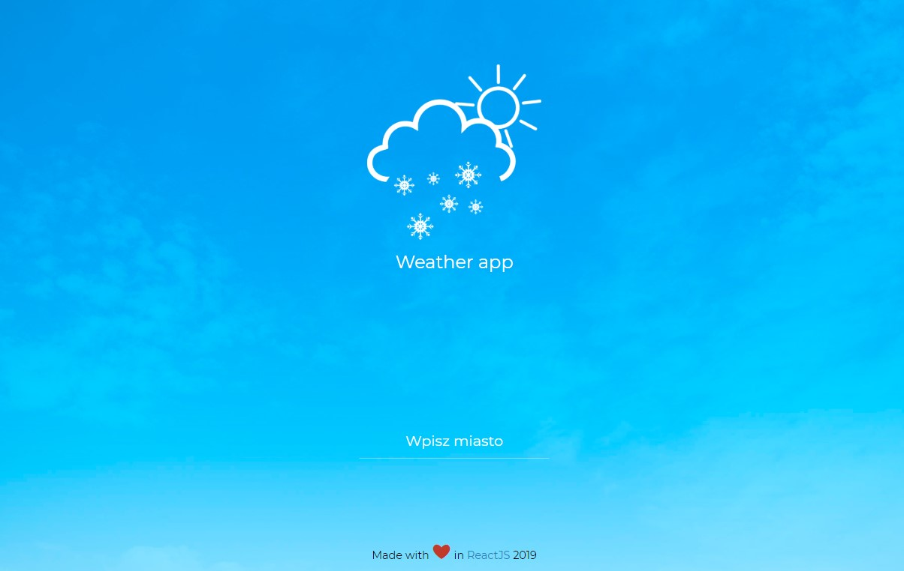
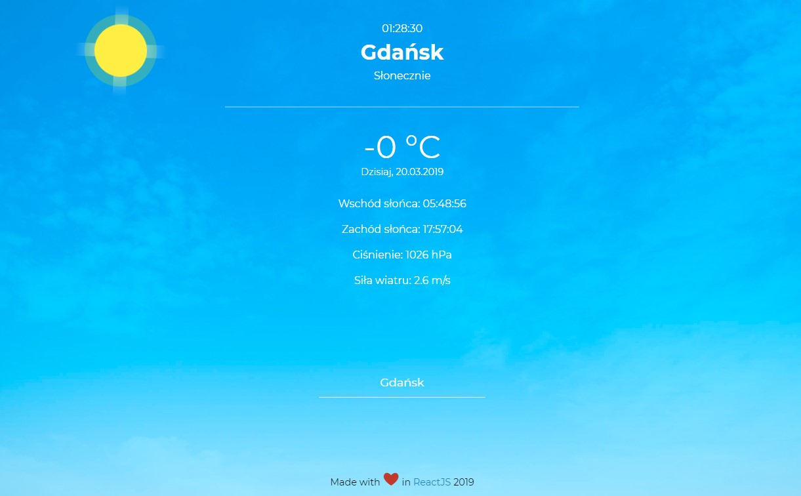

# ReactJS Weather App

> Application use Open Weather Map API for render cities weather. Created using ReactJS.
- [Create React App](https://github.com/facebook/create-react-app)
- [Open Weather Map API](http://api.openweathermap.org)

## Features

- Information about:
    - temperature
    - pressure
    - wind force
    - sunrise
    - sunset
    - date

## Technologies
* ReactJS - version 16.8.3

## Status
Project is finished.

## Compilation and usage

* git clone
* cd weather-reactjs-app
* npm install 
* npm start
> Then go to http://localhost:3000/ and see results

## Screenshots

    

    

    

### License

MIT
